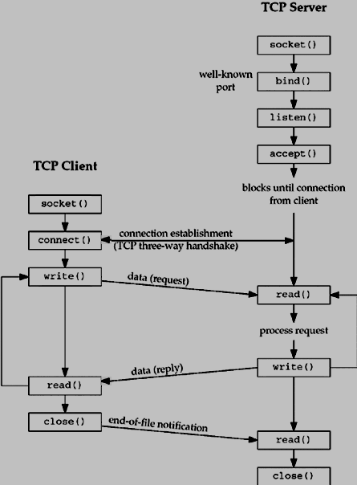

# UNIX-SOCKET
This simple client-server communication aim to explore a concept in unix socket communication.  

## Client Server model in unix-socket communication

Sockets allow communication between two different processes on the same or different machines. To be more precise, it's a way to talk to other computers using standard Unix file descriptors. In Unix, every I/O action is done by writing or reading a file descriptor. A file descriptor is just an integer associated with an open file and it can be a network connection, a text file, a terminal, or something else.  

A Unix Socket is used in a client-server application framework. A server is a process that performs some functions on request from a client. Most of the application-level protocols like FTP, SMTP, and POP3 make use of sockets to establish connection between client and server and then for exchanging data.  

### Server
- Create a socket using `socket()` function.
- Bind the socket to an address using the `bind()` system call. For a server socket on the Internet, an address consists of a port number on the host machine.
- Listen for connections with the `listen()` system call.
- Accept a connection with the `accept()` system call. This call typically blocks the connection until a client connects with the server.
- Send and receive data using the `read()` and `write()` system calls.

### Client
- Create a socket with `socket()` system call.
- Connect the socket to the address of the server using the `connect()` system call.
- Send and receive data. There are a number of ways to do this, but the simplest way is to use the `read()` and `write()` system calls.

